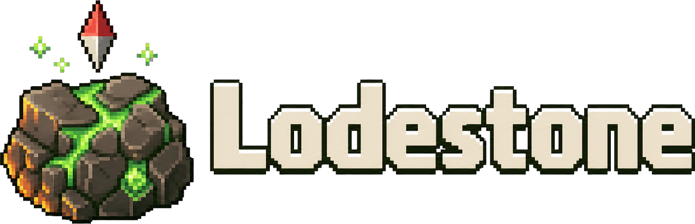

<p align="center">
  
</p>

<p align="center">
  <a href="#requirements"></a>
  <a href="https://store.steampowered.com/app/2710040/"></a>
  <a href="https://github.com/HumanGenome/Lodestone"></a>
  <a href="LICENSE"></a>
</p>

# LodestoneServer

[Delverium](https://store.steampowered.com/app/2710040/) has no dedicated server. LodestoneServer runs the game as one on a Windows machine, and players join it by IP and port through the [Lodestone app](https://github.com/HumanGenome/Lodestone). This repo is for hosts; players only need the app.

## What it does

- Runs Delverium with no screen and no desktop session
- Creates and saves the world on the host, and keeps it running with nobody online
- Takes direct connections on a UDP port
- Serves a live map of the world on its own web port: the game's own terrain art, every player's position, the teleporters, and a timelapse of how the world changed ([docs/map.md](docs/map.md))
- Adds an in-game chat with player and admin commands, since the game has none ([docs/chat.md](docs/chat.md))
- Source RCON and a signed HTTP API for admin tools, once an admin password is set ([docs/admin-api.md](docs/admin-api.md))
- Writes a live roster file and a boot report a panel or a script can read without a login ([docs/status-and-roster.md](docs/status-and-roster.md))
- Bans that survive restarts
- Answers Source server query on the port above the gameplay port, with the real player count
- Optional join password
- Up to 8 players, the game's own limit, and the server takes no seat

## What it does not do

- **It does not ship Delverium.** You install the game files yourself; the server runs them from a folder you choose.
- **It does not replace the player's game.** Everyone joining still runs retail Delverium, with the Lodestone app on top.
- **It is not an anti-cheat.** Lodestone does not police what connected clients do.

## Requirements

| | |
|---|---|
| OS | Windows 10, Windows 11, or Windows Server |
| Game files | A Delverium installation on the host, from your own Steam copy |
| Ports | Two UDP ports, the gameplay port and the one above it for server query; three TCP ports above those for RCON, the admin API and the live map page, opened only for the people who should reach them |
| Hardware | No GPU required; a few hundred MB of disk beyond the game and a modest amount of RAM per server |

## Ports

Everything derives from one number, so you only ever choose the gameplay port.

| Port | Protocol | Used for |
|---|---|---|
| base (default `27016`) | UDP | Gameplay, the port players connect to |
| base + 1 (default `27017`) | UDP | Server query (Source A2S) |
| base + 3 (default `27019`) | TCP | Source RCON, once an admin password is set |
| base + 4 (default `27020`) | TCP | The admin API the Lodestone app's Console tab uses, once an admin password is set |
| base + 5 (default `27021`) | TCP | The live map page ([docs/map.md](docs/map.md)) |

The two UDP ports must be open on the host firewall and forwarded if the server sits behind NAT. Open the TCP ports only for the people who should reach them. RCON and the admin API stay off until `Password` is set under `[Admin]`; the map page is open to anyone with the address unless `AccessKey` is set under `[Map]`.

## Setup

1. Install Delverium on the host through Steam and keep Steam signed in on that machine. The game's executable checks for Steam when it starts, so the server runs in the desktop session where Steam is signed in.
2. Download `LodestoneServer-<version>.zip` from the [latest release](https://github.com/HumanGenome/LodestoneServer/releases/latest) and copy the contents of its `LodestoneServer\bepinex\` folder **over** the game folder, so `winhttp.dll`, `doorstop_config.ini`, `BepInEx\` and `dotnet\` sit next to `Delverium.exe`.
3. Put a file named `steam_appid.txt` next to `Delverium.exe` containing the single line `2710040`.
4. Start the server once from the game folder so it writes its default config files, then stop it:

   ```
   Delverium.exe -batchmode -nographics
   ```

5. Edit `BepInEx\config\com.humangenome.lodestone.host.cfg`: set the gameplay port, the server name, the world name, size and difficulty, and a join password if you want one. Set an admin password in `com.humangenome.lodestone.admin.cfg` to switch on RCON and the admin API.
6. Start the server again. The world is created on the first start. `lodestone\boot-report.txt` next to the game says `HOSTING` once players can join, or exactly what stopped it if they cannot.
7. Hand players the address as `ip:port`. They add it in the Lodestone app and press Connect.

Running two servers on one machine: give each its own copy of the game folder and its own gameplay port; every other port derives from it, and each folder keeps its own saves, config and status files.

## The live map page

Open `http://<server ip>:<game port + 5>/` in a browser. The server serves the page itself; nothing else is installed.

- **The map**: the world drawn from the game's own terrain art, one level at a time, redrawn as players mine, build and explore, sharp when zoomed in.
- **Players**: every connected player marked where they stand, refreshed every few seconds.
- **Points of interest**: the teleporters, live from the game.
- **Timelapse**: the frames the world went through, kept by the server.

The page and its JSON are open to anyone with the address; set `AccessKey` under `[Map]` to require a key. Details and the API in [docs/map.md](docs/map.md).

## Running it from a panel or a script

`lodestone\roster.json` is rewritten every 5 seconds with the server, world and player state. `lodestone\boot-report.txt` is the plain-text verdict of the last start. The HTTP API on port + 4 answers `/api/v1/health` without a signature, and everything that changes the server needs the admin password. Formats and the command list in [docs/status-and-roster.md](docs/status-and-roster.md) and [docs/admin-api.md](docs/admin-api.md).

## Managed hosting

If you would rather not run the machine, [SurvivalServers.com](https://www.survivalservers.com/services/game_servers/delverium/?utm_source=github&utm_medium=readme_install&utm_campaign=lodestone) runs Delverium servers with Lodestone installed and kept current, the ports open, and a control panel with the live map, the console, backups and one-click restores.

## Changelog

Every released version is listed in [CHANGELOG.md](CHANGELOG.md), split by what changed on the **Server** and what changed on the **Client**. Release pages quote the matching section verbatim.

## Contributing

See [CONTRIBUTING.md](CONTRIBUTING.md). Security issues go through [private reporting](.github/SECURITY.md), never a public issue.

## Community note

Lodestone is an independent community project. It is not affiliated with, endorsed by, or supported by Sagestone Games.

## License

MIT, see [LICENSE](LICENSE).
