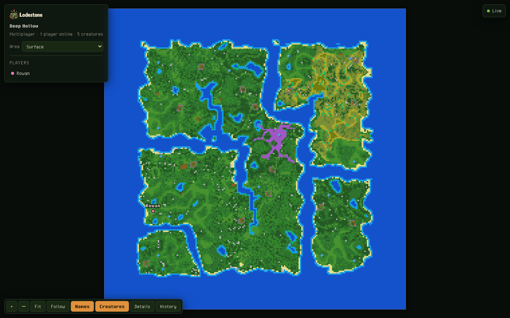

# The live map page

Every Lodestone server draws its world on its own web port, game port + 5 (`27021` for a server on the default `27016`). The page runs inside the game process and needs nothing else installed. Open `http://<server ip>:<game port + 5>/` in a browser.

<p align="center">
  
</p>

## What is on it

- **The world**, one level at a time, drawn from the game's own terrain art: grass, sand, water, stone, farmed soil, the lot. The picture is rebuilt only when tiles actually change, so a busy mining session shows up within seconds and an idle world costs nothing.
- **Close in, the game's own art.** Zoomed out, the map is one colour per tile; zoomed in, the browser draws the same textures the game draws, so a shoreline or a cave mouth looks like it does in play.
- **Players**: every connected player marked where they stand, with their name, refreshed every few seconds. A player whose position has gone stale is shown as stale rather than drawn somewhere wrong.
- **Points of interest**: the teleporters, live from the game.
- **Timelapse**: the server keeps the frames the world went through, and the page plays them back per level.

## Configuration

`BepInEx\config\com.humangenome.lodestone.map.cfg`, written with defaults on the first start:

```ini
[Map]
Enable = true
Port = 0                 # 0 = game port + 5
BindAddress = 0.0.0.0
AccessKey =              # empty = the page and its JSON are open to anyone with the address
RescanSeconds = 60           # look for changed tiles this often
PlayerIntervalSeconds = 1    # sample player positions this often

[Timelapse]
Enable = true
MinMinutes = 60          # at most one frame this often
MinChangedTiles = 25     # and only when at least this many tiles changed
MaxFrames = 240
MaxMegabytes = 200
```

Leave `Port` at `0`. It derives from the host's gameplay port, so the two never drift when you change one; a fixed number is honoured only if you set it on purpose.

With `AccessKey` set, every request must carry the key as an `X-Lodestone-Key` header or a `key` query parameter, and the page asks for it once.

## The API

Everything the page draws comes from these routes, so a Discord bot, a hosting panel or your own page can read them too.

| Route | Answers |
|---|---|
| `/` | the viewer, one self-contained page |
| `/api/map` | the levels the server knows, each with its size, revision and tile image URL |
| `/tiles/<levelId>.png?v=<revision>` | that level's map image |
| `/tiles/<levelId>-data.png?v=<revision>` | that level's tile grid as data, one pixel per tile |
| `/api/players` | every connected player with level and position |
| `/api/pois` | the teleporters |
| `/api/timelapse` | the timelapse summary; `?level=<id>` for one level's frames |
| `/timelapse/<levelId>/<unixMs>.png` | a past frame |
| `/assets/tileset.png`, `/assets/tileset.json` | the terrain art the viewer draws close in |

`revision` only advances when the tiles changed, so a cached image stays valid until it is really stale. Positions are in world units, which are tile units, so nothing needs converting to land on the map.

## What it costs the server

Scanning runs in short slices on the game thread with a fixed budget per frame, and a rescan happens only when something changed. The heavy work, turning tiles into a picture, runs off the game thread. A world nobody is changing costs the server nothing beyond the player position sample.
